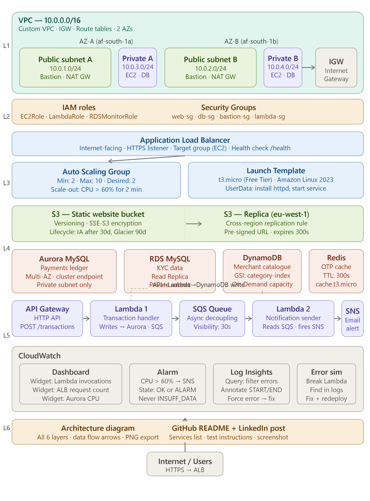

# OluPay 2.0 — AWS Cloud Infrastructure

## Overview
OluPay is a Lagos-based fintech platform that has grown from 400,000 to 
2 million users. This repository documents the complete AWS infrastructure 
rebuild designed to handle salary day traffic spikes (25th of every month) 
at under $200/month steady-state cost.

**Scenario:** A — OluPay 2.0  
**Cohort:** BaseStack Academy AWS Cloud Accelerator — Cohort 1  
**Region:** af-south-1 (Cape Town) — Primary | eu-west-1 — DR  

---

## Architecture Diagram



---

## AWS Services Used

| Layer | Services |
|---|---|
| Foundation & Identity | VPC, Subnets, IGW, Route Tables, Security Groups, IAM |
| Compute & Scaling | EC2, ALB, Auto Scaling Group, Launch Template |
| Storage | S3 (static website), S3 (data bucket), Cross-region replication |
| Databases | Aurora PostgreSQL, RDS MySQL, DynamoDB, ElastiCache Redis |
| Serverless & Events | Lambda, API Gateway, SQS, SNS |
| Observability | CloudWatch Dashboard, Alarms, Logs, Logs Insights |

---

## Infrastructure Summary

### VPC
- CIDR: 10.0.0.0/16
- 4 subnets across 2 AZs (af-south-1a and af-south-1b)
- Public subnets: Bastion host, NAT Gateway, ALB
- Private subnets: EC2 instances, Aurora, RDS, ElastiCache

### Compute
- EC2 t3.micro instances behind an Application Load Balancer
- Auto Scaling Group: Min 2, Max 10, scale-out at CPU > 60%
- Launch Template with UserData installing Apache web server

### Databases
- Aurora PostgreSQL: payments ledger, cluster endpoint, Multi-AZ
- RDS MySQL: KYC records, Read Replica
- DynamoDB: merchant catalogue, GSI on category
- ElastiCache Redis: OTP caching, TTL 300 seconds

### Serverless Pipeline
- Lambda 1 (TransactionHandler): API Gateway → DynamoDB → SQS
- Lambda 2 (NotificationSender): SQS → SNS → email delivery
- HTTP API Gateway with live POST /transactions endpoint
- SQS visibility timeout: 60 seconds

---

## How to Test

### 1. Static Website
Visit the live S3 static website:
http://olupay-static-yourname.s3-website.af-south-1.amazonaws.com

### 2. API Gateway Endpoint
Send a POST request to create a merchant:
```bash
curl -X POST https://[api-id].execute-api.af-south-1.amazonaws.com/transactions \
  -H "Content-Type: application/json" \
  -d '{"name":"Mama Put Kitchen","category":"food"}'
```
Expected response:
```json
{"id": "generated-uuid-here"}
```

### 3. Verify DynamoDB Write
After the API call check DynamoDB:
- AWS Console → DynamoDB → Tables → Merchants → Explore items
- New merchant record should appear with the returned ID

### 4. Verify SNS Notification
After the API call check your email inbox for an alert from `olupay-alerts` SNS topic.

### 5. Redis OTP Test
From the bastion host:
```bash
redis-cli -h [redis-endpoint] -p 6379 --tls
SET otp:test-user "123456" EX 30
GET otp:test-user
TTL otp:test-user
# Wait 30 seconds
GET otp:test-user
# Expected: (nil)
```

### 6. CloudWatch Dashboard
View live metrics at:
- AWS Console → CloudWatch → Dashboards → olupay-dashboard

---

## Security Notes
- All databases in private subnets — no public accessibility
- IAM roles scoped to specific resource ARNs — no wildcard resources
- Redis encrypted at rest and in transit
- S3 data bucket has public access blocked
- Security groups follow least-privilege inbound rules
- Region restricted to af-south-1 and eu-west-1 via IAM trust conditions

---

## Cost Summary

| Layer | Monthly Cost |
|---|---|
| Compute (EC2 + ALB) | ~$17.00 |
| Storage (S3) | ~$2.00 |
| Databases (Aurora + RDS + DynamoDB + Redis) | ~$85.00 |
| Serverless (Lambda + API GW + SQS + SNS) | ~$145.68 |
| Data transfer | ~$5.00 |
| **Total steady state** | **~$180.00** |

---

## Author
Your Name  
BaseStack Academy — AWS Cloud Accelerator — Cohort 1