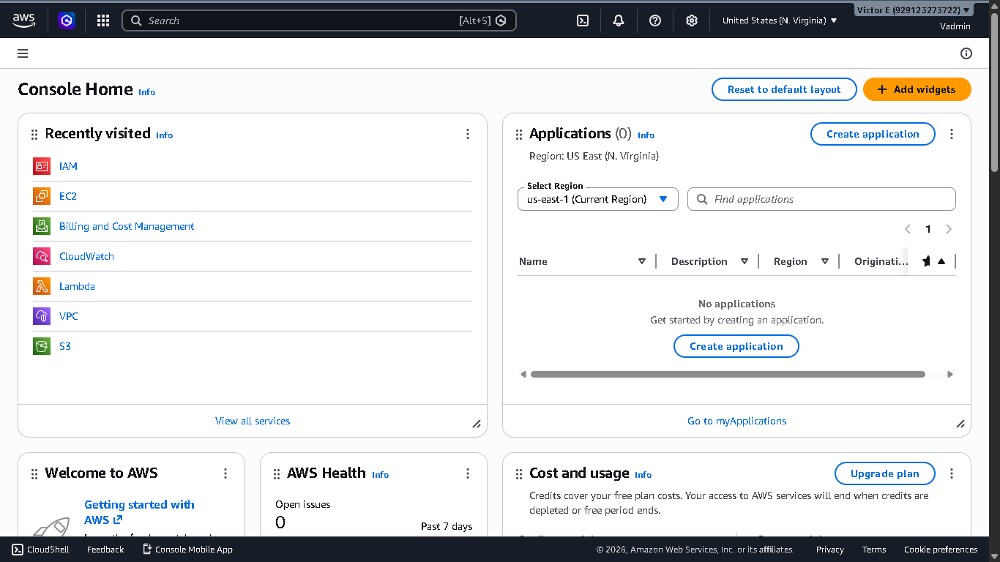
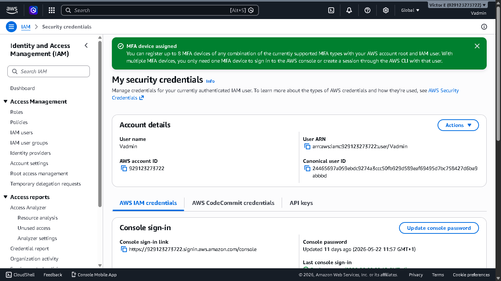
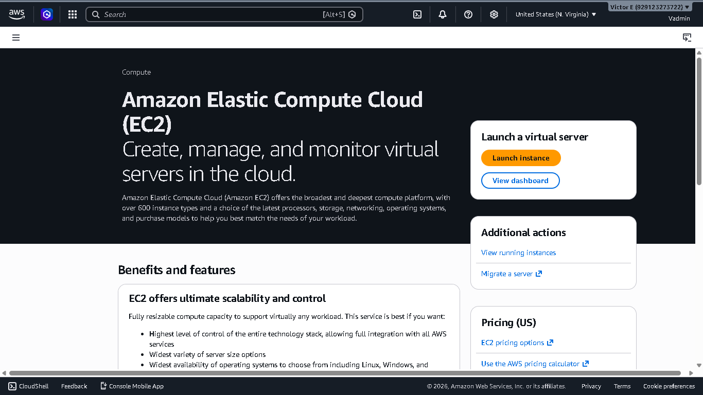
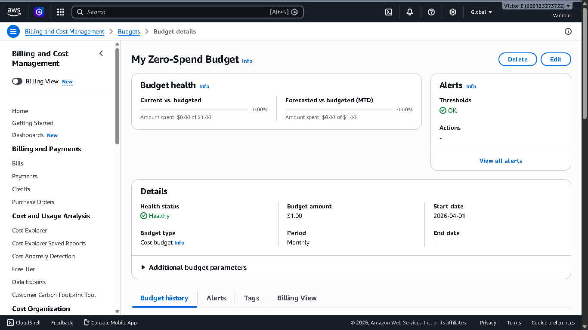
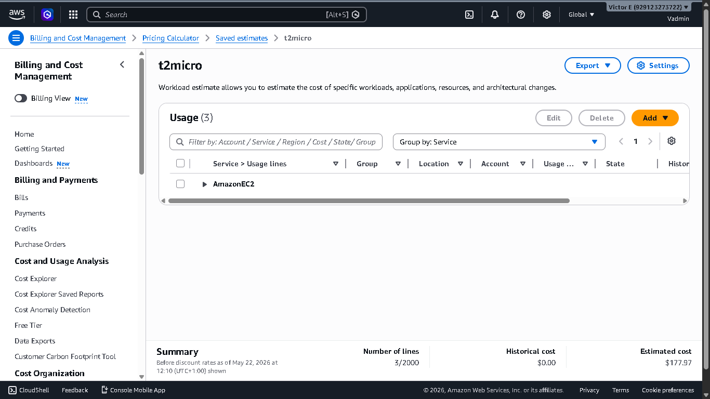

# Lab Name: IAM User Creation & MFA Setup

## Overview
The Lab was done to create an IAM user which will be used for day to day activity, setup MFA for both the IAM and the root account create a Zero spend budget and use the AWS Price Calculator(bonus excercise)

## Learning Objectives
- Create an IAM user with least-privilege permissions
- Enable MFA on the root and IAM accounts
- Understand the difference between root and IAM users
- 

## AWS Services Used
- AWS IAM (Identity and Access Management)
- AWS Console
- AWS Price Calculator

## Prerequisites
- AWS account (free tier)
- MFA device (Google Authenticator or Authy)

## Step-by-Step Instructions

### Step 1: Log in to AWS Console
1. Go to https://console.aws.amazon.com
2. Sign in with your root account email
3. Navigate to IAM service

### Step 2: Create IAM User
1. Click **Users** in the left sidebar
2. Click **Add users**
3. Enter username: `Vadmin`

### Step 3: Setup MFA for root/IAM user
1. Click on the account name at the top right corner
2. Click **Security Credentials**
3. Scroll down to the MFA section and click **Assign MFA Device**
4. Assign device name, scroll down and select Authenticator App and click **Next**
5. Scan the QR code with the Authenticator App and enter the next 2 codes and click **Add MFA**

### Step 4: Create Budget
1. Searh for **Billing and Cost Management**
2. Click **Budgets** in the left bar
3. Click **Create Budget** at the top right 
4. Selcet a *Budget Setup* and *Template*
5. Set a *Budget name* and specify the *Email Recipients*

### Step 5: Estimate t2micro cost
1. Search for **Price Calculator**
2. Click **Create Workload Estimate**
3. Set *Estimate Name* and *Select Rates* and **Submit**
4. Add *New Services*
5. Choose *Account*, *Location Type and Location*, *Service* and *Group* and click **Next**
6. Configure AmazonEC2 by selecting required services and setting parameters for them and click **Save Changes**

## Screenshots

## Key Concepts Learned
- The root account should NEVER be used for day-to-day operations
- IAM policies follow the principle of least privilege
- MFA adds a critical second layer of security
- Budgets and Cost should be estimated/set up to avoid unforseen costs

## Cleanup
To avoid charges, the following resources were deleted after the lab:
- IAM user `Vadmin` was disabled (kept for practice)

---
*Completed: May 2026 | BaseStack AWS Cloud Accelerator — Cohort 1*